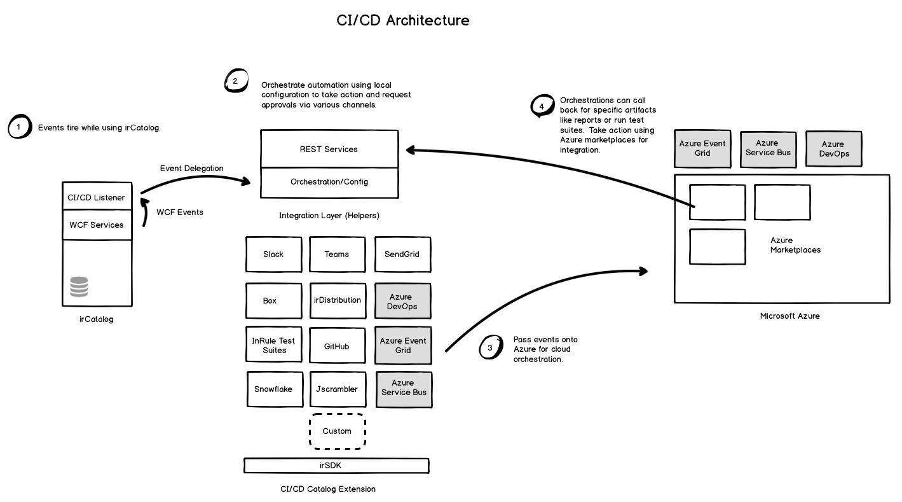
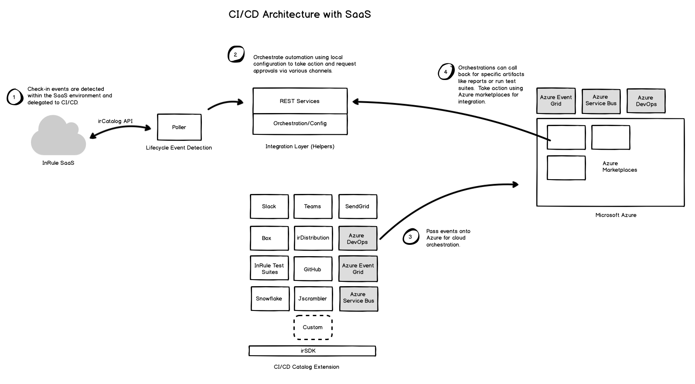

## Introduction

Many InRule Technology customers integrate rule applications (and the decisions they contain) into business-critical application lifecycles.  Over the years, we have gathered use cases and feedback from customers covering co-deployment, automation, team awareness, orchestration/configuration, and multi-channel support for the most common integrations we see.  This repository contains much of what you need to full-automate your lifecycle.  Moreover, if gaps are discovered in the capability, we believe the structure and examples provided will make short work of adding new integrations and custom behaviors.

#### Orchestration by Configuration
Lifecycles are often like a snowflake.  While we see many patterns, the combinations of what customers need vary widely.  For this reason, we provide a basic form of orchestration by configuration.  It is possible to simply listen for an irCatalog® check-in event and send a slack notification.  While this greatly improves team visibility into what's taking place, it only scratches the surface of what's needed by many organizations.  We discovered many customers need notifications, but also require rich interactions with Azure DevOps, GitHub and to run a test suite all from the same check-in event.  To solve the complexity problem, we provide a means to configure steps.  Each step relies on a single integration (Slack, GitHub, etc.) to perform specific actions.  We believe the current capability will get teams up and running quickly and hope everyone will provide feedback.

#### Licensing
This code may be downloaded and modified as needed per the attached [license agreement](LICENSE); however, the dependencies on irSDK® require you have licensing to run the code.  Reach out to your salesperson to inquire about licensing to cover your deployment.

#### Support
This capability is supported by support@inrule.com.  Issues and requests will be routed to the internal team for triage and a response.

## InRule CI/CD Architecture
What is this and how does it work?  irCatalog emits many lifecycle events (check-in, check-out, etc.).  When irAuthor® or Author Studio™ interacts with irCatalog, events emit from the messages inbound through the service endpoint.  This capability is responsible for intercepting those events and passing them along to the appropriate component for processing and automation.  In some cases, an event can be blocked while waiting for an approval (setting a label for example).  

#### The InRule CI/CD solution is comprised of four major components
* *WCF listener binaries and configuration* for the instance of irCatalog service to which we want to apply the CI/CD runtime enhancements.

* *InRule CI/CD service* that can be hosted in Azure, as an app service, or on-premise.  Depending on the chosen deployment configuration, the InRule CI/CD service can either handle all the events and actions or only be used for a number of on demand services, such as generating a rule application report or facilitating the approval of a label assignment.

* *Event processors*.  The default CI/CD installation comes with a number of built-in integrations that can be enabled and configured on a per installation basis: Slack, Email (SendGrid), Windows/Azure EventLog, SQL Server database, Azure AppInsights, Azure Service Bus, Azure Event Grid, Azure DevOps pipeline, GitHub, Box.com.

* *Catalog poller* for CI/CD architecture with SaaS. This is an Azure function that runs on a schedule and checks for new revisions checked into the catalog service at which it is pointed.  The poller is useful when the catalog service's binaries and configuration are not accessible to be enhanced with the CI/CD artifacts. It picks up check in event details from the catalog service and sends them to the InRule CI/CD service.

* Other than the ability to post captured catalog events to the various subscribers/consumers listed above, **the InRule CI/CID solution includes a number of services and actions** relevant to a rule application life cycle in the enterprise:

    * Generate a **rule application report** for the rule application and revision that triggered the event.
    * Generate a **rule application difference report**, showing the changes between the previous revision and the revision that triggered the event, when at least two revisions are available.
    * Download existing **regression test suite files** from a designated GitHub or local file system location, run all available regression tests, and return the detailed results, including pass/fail status for each test and overall, as well as making the test results file available.
    * Call the **JavaScript distribution service**, pass the rule application revision that triggered the event, and return the corresponding JavaScript file or the list of issues that prevented the conversion.
    *  Call the **Java distribution service**, pass the rule application revision that triggered the event, and return the corresponding JAR file or the list of issues that prevented the conversion.
    * For the **Azure DevOps pipeline** event subscriber, the default installation contains a sample that triggers a pipeline running regression tests from test suite files available in GitHub or DevOps repository, against the rule application revision that triggered the event.  If all regression tests pass, then the pipeline provided promotes the revision to another InRule catalog, as defined in YAML files referenced by the DevOps pipeline.  

### Documentation and Samples
* [CI/CD Deployment and configuration](doc/deployment.md)
* [CI/CD Architecture with SaaS / InRule catalog poller](doc/CatalogPoller.md)
* [Orchestration by configuration](doc/OrchestrationByConfiguration.md)
* [Understanding and using notifications](doc/Notifications.md)
* [Slack integration](doc/InRuleCICD_Slack.md)
* [Azure DevOps integration](doc/DevOps.md)
* [Trigger a DevOps pipeline running regression tests and promoting rule application](devops)
* [Azure Event Grid integration](doc/AzureEventGrid.md)
* [Azure Service Bus integration](doc/AzureServiceBus.md)
* [Generate rule application report](doc/RuleAppReport.md)
* [Generate rule application difference report](doc/RuleAppDiffReport.md)
* [Generate Java rule application (JAR file) with irDistribution](doc/Java.md)
* [Generate JavaScript rule application with irDistribution](doc/JavaScript.md)
* [Jscrambler enhanced JavaScript protection](doc/jscrambler.md)
* [Snowflake Javascript rule integration](doc/Snowflake.md)
* [CI/CD approval flow](doc/ApprovalFlow.md)
* [Configure where to upload files, like GitHub](doc/UploadTo.md)
