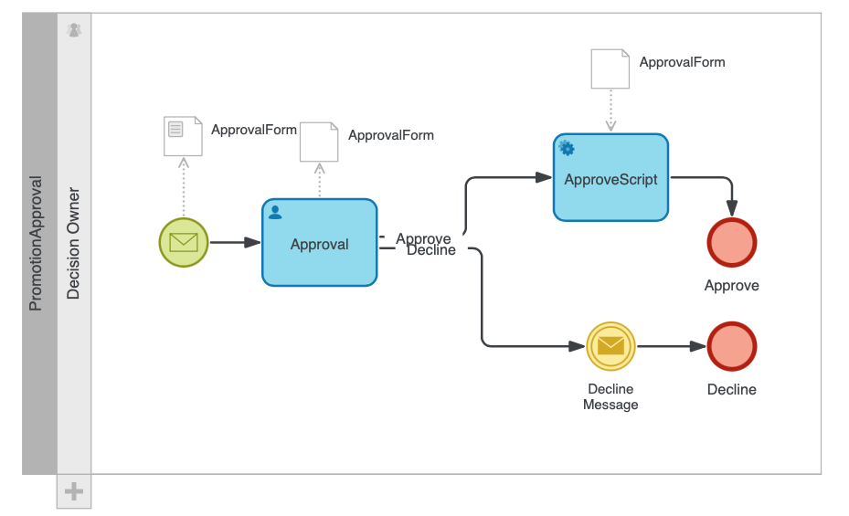
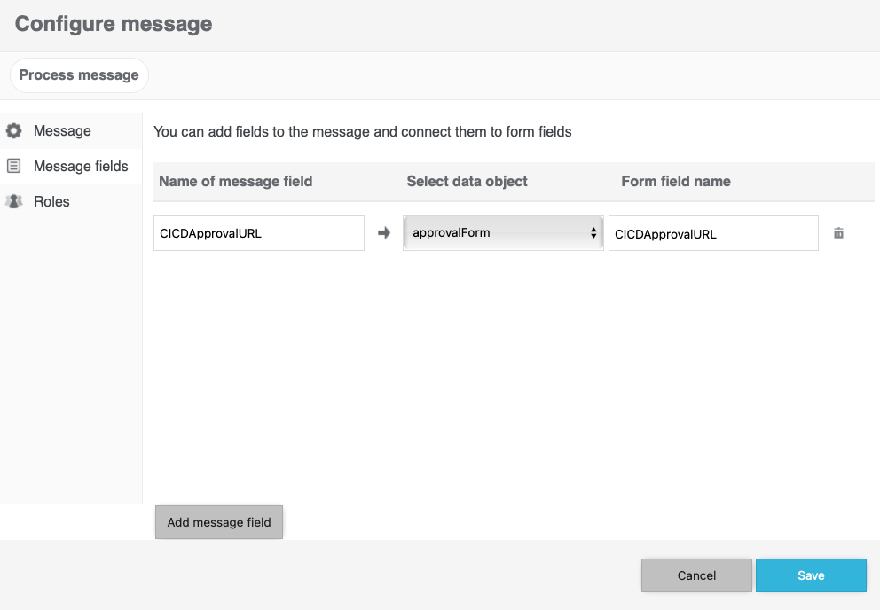
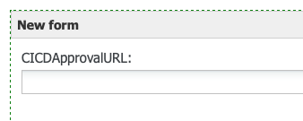
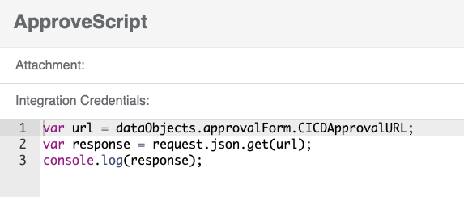

### Barium Live Integration with CI/CD

InRule CI/CD now supports performing actions in Barium Live.  Any lifecycle event from InRule irCatalog can create a process instance within a Barium Live deployment. 


---
#### Configuration

All relevant aspects of this integration are set in the configuration under the default Barium moniker (see example below).  Create instance is an extension of the Barium configuration to further define specific activities that can take place in Barium. Prior to configuration, a valid process model must be deployed.

Below is a [sample of minimal configuration](../config/InRuleCICD_BariumCreateInstance.config) for creating a process instance in Barium Live when a rule application has been checked in. This configuration example is **applicable for a local deployment**.  **For the Azure CI/CD app service**, the configuration follows the format in the [starter cloud config file](../config/InRule.CICD.Runtime.Service.config.json).
<dl><br /></dl>
  
````
    <add key="CatalogEvents" value="CheckinRuleApp"/>
    <add key="OnCheckinRuleApp" value="Barium"/>
  
    <add key="Barium.Host" value="************************************************"/>
    <add key="Barium.APIVersion" value="v1.0"/>
    <add key="Barium.Username" value="C:\Temp\"/>
    <add key="Barium.Password" value="C:\Temp\"/>
    <add key="Barium.Apikey" value="Slack"/>
    <add key="Barium.Webticket" value="GitHub"/>

    <add key="Barium.CreateInstance" value="true"/>
	<add key="Barium.CreateInstance.Template" value="form"/>
	<add key="Barium.CreateInstance.Message" value="START"/>
	<add key="Barium.CreateInstance.ProcessName" value="IntegrationTesting"/>
````
<dl><br /></dl>

|Configuration Key | Comments
--- | ---
|Barium.**Host**| The host name of the Barium Live environment.
|Barium.**APIVersion**| The version of the API. Default is v1.0.
|Barium.**Username**| The username of the integration user with permissions to access the API and the process to create an instance from.
|Barium.**Password**| The password of the integration user.
|Barium.**Apikey**| The API key that has been created in Barium.
|Barium.**Webticket**| Set to true to authenticate with Barium.
|Barium.**CreateInstance**| Set to true to enable the create instance activity.
|Barium.**CreateInstance.Template**| The template defined in the Barium process to create an instance from.
|Barium.**CreateInstance.Message**| The start message configured in the Barium process.
|Barium.**CreateInstance.ProcessName**| The name of the Barium process to create an instance from.


<dl><br /></dl>

#### Approval workflow with a Barium Process

With the latest release, administrators can now delegate approvals for promotions (based on a label change) to Barium Live processes.  CI/CD uses an encrypted link for approvals across channels and Barium Live is no exception.  The link is sent over to a Barium Live process as data.  Once it's part of the process, the administrator has all of the capabilities provided by the Barium Live product to route and track approvals.  Below are the configuration settings you need to pass the approval link.

````
<add key="BariumLive.Host" value="https://bariuminstancename.yourdomain.com"/>
<add key="BariumLive.APIVersion" value="v1.0"/>
<add key="BariumLive.Username" value="youruser@yourdomain.com"/>
<add key="BariumLive.Password" value="******************"/>
<add key="BariumLive.Apikey" value="*******************************"/>
<add key="BariumLive.Webticket" value="true"/>
<add key="BariumLive.Template" value="form"/>
<add key="BariumLive.Message" value="Start"/>
<add key="BariumLive.ProcessName" value="PromotionApproval"/> <!--Can be any process name-->
<add key="BariumLive.ApprovalUrlField" value="CICDApprovalURL"/> <!--You can pass any field name so long as it's the same end-to-end-->
````

This is what a Barium Live approval process looks like below.  If you are already a Barium Live user, [click here](PromotionApproval.bmap) to download the process example for your own environment.



Configure your start event message to accept the static URL from the CI/CD service.  Note the names match the example above:



Add your approval form with a single field in a form.  Once you have this working, you can design your forms and process the way you like:



Most of what you need should be preserved in the example provided above.  Note that the process instance contains a Script Service.  If you do not have access to the script service, reach out to your support or services team.  The script service uses the approval link to complete the approval process.




