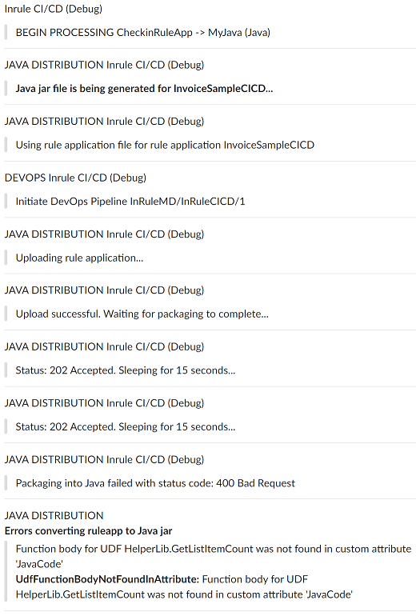

### Generate Java Rule Application (JAR file) with irDistribution Service

As with the JavaScript® integration, the DevOps framework also allows the user to configure the automated rule application Java JAR generation and distribution.  A subscription key is required before calling the irDistribution™ service, along with the URL of the service.  Currently, the Java JAR file generation is not part of the standard InRule® offering, the way the JavaScript integration is.  

The InRule DevOps Java component creates a Java version of the rule application by calling the irDistribution service with the revision of the rule application involved in the captured catalog event, using the client subscription key.  The file is then uploaded to either GitHub or to Box.com and the link distributed over the preferred notification channel.

The conversion of the rule application to Java JAR takes longer than most other actions available with InRule DevOps Service.  Watching the debug notifications shows the progression of the interactions with the distribution service, until the link is also posted as a normal notification.  Since certain rule application elements are not compatible with the Java correspondent, failure messages are posted when that is the case for the revision involved in the linked irCatalog® event.



---
#### Configuration

All relevant aspects of this integration are set in the configuration, under the default "Java" moniker.  Like for all other DevOps event handlers, it is possible to create any number of configuration groups with 'type="Java"', which can then be used with any of the intercepted catalog events.

This is a [sample of minimal configuration](../config/InRuleCICD_Java.config) for generating the Java JAR file for the rule application being checked in. This configuration example is **applicable for a local deployment**.  **For the DevOps app service**, the configuration follows the format in the [starter cloud config file](../config/InRule.CICD.Runtime.Service.config.json).

````
  <add key="CatalogEvents" value="CheckinRuleApp"/>
  <add key="OnCheckinRuleApp" value="Java"/>
  
  <add key="Java.JavaDistributionApiKey" value="************************************************"/>
  <add key="Java.JavaDistributionUri" value="https://ir-distributionapi-prod-ncus-fa.azurewebsites.net/api/"/>
  <add key="Java.JavaDistributionInPath" value="C:\Temp\"/>
  <add key="Java.JavaDistributionOutPath" value="C:\Temp\"/>
  <add key="Java.NotificationChannel" value="Slack"/>
  <add key="Java.UploadTo" value="GitHub"/>
````

|Configuration Key | Comments
--- | ---
|Java.**JavaDistributionInPath**| The key provided by InRule for access to the Java distribution service, coming with the specific license.
|Java.**JavaDistributionUri**| The URI for the InRule Java distribution service.
|Java.**JavaDistributionInPath**| The local folder used as the temporary location for the rule application file before being sent to the irDistribution service. For the Azure deployment with DevOps service, this location is overridden with the default TEMP location for the app service.
|Java.**JavaDistributionOutPath**| The local folder used as the temporary location for saving the generated Java JAR file before upload to either GitHub or Box.com. For the Azure deployment with DevOps service, this location is overridden with the default TEMP location for the app service.
|Java.**UploadTo**| Either GitHub or Box.com. Once completed successfully, the outcome of this action is a notification with the download link for the JAR file.

