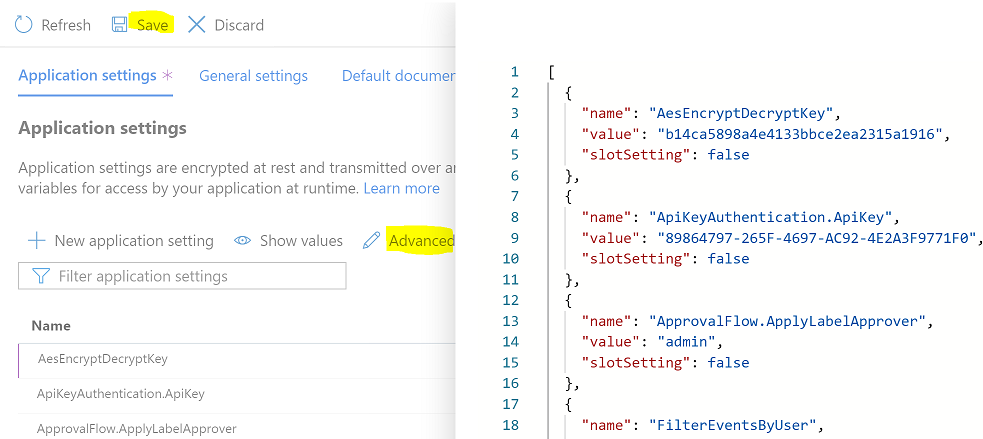

## Configure InRule CICD service
The service requires a set of key value pairs in order to function properly, like the subscription key provided by InRule and the symmetric encryption/decryption key used to secure the communication with the irCatalog® Service.

For now, it is possible to [download the starter config file](../config/InRule.CICD.Runtime.Service.config.json), in the format that is accepted when updating the app service via the Azure portal, and edit it. The starter file has only a few keys enabled, enough to ensure the encryption of the communication with the catalog and have the service react to a number of catalog events with a Slack message. The Slack webhook URL would have to be replaced with the correct value needed to send messages to the channel chosen and configured by the user.

For all the available actions, follow the corresponding details available at the links below, which include how :

* [Understanding and using notifications](Notifications.md)
* [Slack integration](InRuleCICD_Slack.md)
* [Azure DevOps integration](DevOps.md)
* [Trigger a DevOps pipeline running regression tests and promoting rule application](../devops)
* [Azure Event Grid integration](AzureEventGrid.md)
* [Azure Service Bus integration](AzureServiceBus.md)
* [Generate Rule Application Report](RuleAppReport.md)
* [Generate Rule Application Difference Report](RuleAppDiffReport.md)
* [Generate Java Rule Application (JAR file) with irDistribution Service](Java.md)
* [Generate JavaScript Rule Application with irDistribution Service](JavaScript.md)
* [CI/CD Approval Flow](ApprovalFlow.md)

The encryption being symmetric, the same key value must be set in the Azure catalog app service's configuration (**AesEncryptDecryptKey**). Similarly, an authentication key (**ApiKeyAuthentication.ApiKey**) is required to communicate with the CI/CD service, which has to match the value set for the catalog service.

|Configuration Key | Comments
--- | ---
|**ApiKeyAuthentication.ApiKey**| A string added to the authorization header on the request made by the listener component to the CI/CD service. The value can be any string and we recommend using randomly generated GUID values. For on-premise deployments, this parameter is not used.   Used for both the client and server components.  For a pair of catalog and CI/CD services that are set to work together, **this parameter must be set to the same value on both services**.
|**AesEncryptDecryptKey**| A string value used for symmetric encryption/decryption of the payload sent by the catalog listener component to the CI/CD service. It must be between 16 and 32 characters long, with a combination of letters and numbers. For on-premise deployments, this parameter is not used.   Used for both the client and server components.  For a pair of catalog and CI/CD services that are set to work together, **this parameter must be set to the same value on both services**.

Next, edit the json config files with all the pertinent configuration parameters to drive the runtime behavior, like which actions to run on events and necessary configuration for each action.

* In [Azure portal](https://portal.azure.com), navigate to the App Service Editor:

    
* Open the bulk configuration editor, by clicking "Advanced edit", and merge the items in the file downloaded and edited before.  You must maintain the validity of the JSON array content, following the format in the two files to merge only the new configuration entries:

    
* Click Save and agree with the action that restarts the app service:

    

* If the InRule CI/CD App Service was created and configured after setting up the CI/CD components on the irCatalog App Service, it is necessary to update the irCatalog App Service configuration with the newly created InRule CI/CD App Service URI.  This can be done by navigating to the irCatalog App Service in [Azure portal](https://portal.azure.com) and setting the value of the InRuleCICDServiceUri parameter.  Make sure to include "/Service.svc/api", like in the example below.  Saving the configuration and restarting the irCatalog App Service are required.

    

* To confirm the integration with the irCatalog App Service, generate an event for which a handler was configured and validate that the triggered actions are correct.
